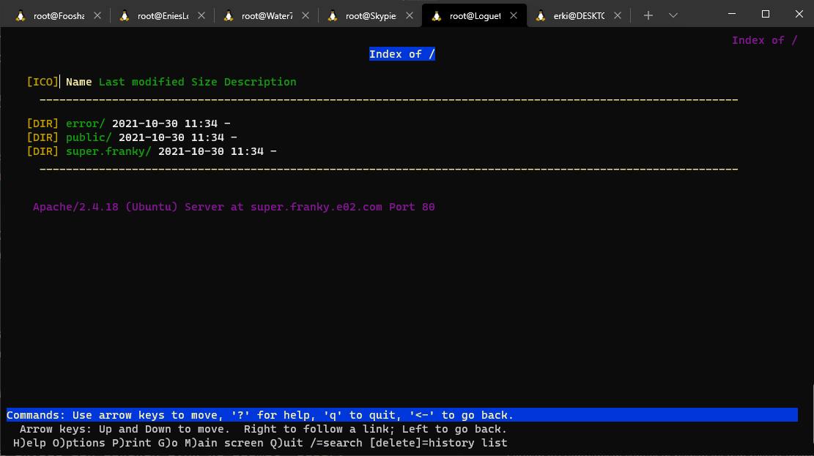

# Jarkom-Modul-2-E02-2021

Berikut ini adalah laporan resmi dari Praktikum Jaringan Komputer Modul 1 tahun 2021 di Institut Teknologi Sepuluh Nopember

Dokumen ini ditulis oleh

-   05111940000063 - Ryan Garnet Andrianto
-   05111940000050 - Erki Kadhafi Rosyid
-   05111940000141 - M. Farhan Haykal

### 1. EniesLobby akan dijadikan sebagai DNS Master, Water7 akan dijadikan DNS Slave, dan Skypie akan digunakan sebagai Web Server. Terdapat 2 Client yaitu Loguetown, dan Alabasta. Semua node terhubung pada router Foosha, sehingga dapat mengakses internet :

- Untuk langkah awal buat topologi seperti di bawah ini:


- Setelah membuat topologi seperti di atas maka langkah selanjutnya adalah :

a. Menambahkan konfigurasi di bawah ini untuk router Foosha :

`iptables -t nat -A POSTROUTING -o eth0 -j MASQUERADE -s 10.30.0.0/16`

`cat /etc/resolv.conf`

b. Tambahkan konfiggurasi di bawah ini pada node selain foosha :

`echo nameserver 192.168.122.1 > /etc/resolv.conf`

c. Lakuka ping google.com pada semua node untuk mengecek apakah node telah terhubung ke internet: 


Setelah semua node berhasil melakukan ping google.com maka topologi sudah dapat mengakses ke internet


### 2. Buat website utama dengan mengakses franky.e02.com dengan alias www.franky.e02.com pada folder kaizoku
- Dikarenakan EnniesLoby akan menjadi DNS Master maka akan dilakukan instalasi bind9 dengan command di bawah ini :

`apt-get update`

`apt-get bind9 -y`

- Selanjutnya, akan dilakukan konfigurasi pada /etc/bind/named.conf.local sebagai berikut :


- Selanjutnya buat folder kaizoku dengan command sebagai berikut :

`mkdir /etc/bind/kaizoku`

- Selanjutnya copykan file db.local pada path /etc/bind ke dalam folder kaizoku yang baru saja dibuat dan ubah namanya menjadi e02.com

`cp /etc/bind/db.local /etc/bind/kaizoku/e02.com`

-Selanjutnya lakukan konfigurasi pada /etc/bind/kaizoku/e02.com sebagai berikut :


- Selanjutnya lakukan restart bind9 EnniesLobby dengan command sebagai berikut :

`service bind9 restart`

- Selanjutnya edit file /etc/resolv.conf pada client Loguetown dan Alabasta dengan menuliskan IP EnniesLobby sebagai berikut:


- Selanjutnya lakukan ping ke domain franky.e02.com pada salah satu client yaitu Loguetown atau Alabasta dengan command sebagai berikut :

`ping franky.e02.com`


Jika berhasil maka IP EnniesLobby lah yang akan muncul.


### 3. Buat subdomain super.franky.e02.com dengan alias www.super.franky.e02.com yang diatur DNS nya di EniesLobby dan mengarah ke Skypie
- Tambahkan 2 line di bawah ini ke dalam /etc/bind/kaizoku/e02.com pada EnniesLobby :


- Setelahnya restart bind9 dengan :

`service bind9 restart`

- Lakukan tes dengan ping super.franky.e02.com atau wwww.super.franky.e02.com :


Jika berhasil maka IP yang muncul adalah IP Skypie


### 4. Buat juga reverse domain untuk domain utama
- Edit file /etc/bind/named.conf.local menjadi sebagai berikut :

`vim /etc/bind/named.conf.local`


- Selanjutnya Copykan file db.local pada path /etc/bind ke dalam folder kaizoku yang sudah dibuat dan ubah namanya menjadi 2.30.10.in-addr.arpa

`cp /etc/bind/db.local /etc/bind/kaizoku/2.30.10.in-addr.arpa`

- Edit file 2.30.10.in-addr.arpa menjadi seperti gambar di bawah ini:


- Kemudian restart bind9 dengan command :

`service bind9 restart`

- Untuk mengecek apakah konfigurasi sudah benar atau belum, lakukan perintah berikut pada client Loguetown

```
// Install package dnsutils
// Pastikan nameserver di /etc/resolv.conf telah dikembalikan sama dengan nameserver dari Foosha
apt-get update
apt-get install dnsutils
```

- Selanjutnya pada Loguetown lakukan command di bawah ini:

```
//Kembalikan nameserver agar tersambung dengan EniesLobby
host -t PTR 10.30.2.2
```


### 5. Buat Water7 sebagai DNS Slave untuk domain utama
#### I. Konfigurasi pada Server EnniesLobby

- Edit file /etc/bind/named.conf.local dan sesuaikan dengan syntax berikut :

```
zone "e02.com" {
        type master;
        notify yes;
        also-notify { 10.30.2.3; }; // Masukan IP Water7 tanpa tanda petik
        allow-transfer { 10.30.2.3; }; // Masukan IP Water7 tanpa tanda petik
        file "/etc/bind/kaizoku/e02.com";
};
```


- Lakukan restart bind9

`service bind9 restart`

#### II. Konfigurasi pada Server Water7

- Buka Water7 dan update package lists dengan menjalankan command:

`apt-get update`

-Selanjutnya lakukan instalasi aplikasi bind9 pada Water7 dengan perintah:

`apt-get install bind9 -y`

- Kemudian buka file /etc/bind/named.conf.local dan tambahkan syntax berikut:

```
zone "e02.com" {
    type slave;
    masters { 10.30.2.2; }; // Masukan IP EniesLobby tanpa tanda petik
    file "/var/lib/bind/e02.com";
};
```


- Lakukan restart bind9

`service bind9 restart`

#### III. Testing

- Pada server EniesLobby silahkan matikan service bind9

`service bind9 stop`


- Pada client Loguetown pastikan pengaturan nameserver mengarah ke IP EniesLobby dan IP Water7


- Lakukan ping ke jarkom2021.com pada client Loguetown. Jika ping berhasil maka konfigurasi DNS slave telah berhasil


### 6. Setelah itu terdapat subdomain mecha.franky.e02.com dengan alias www.mecha.franky.e02.com yang didelegasikan dari EniesLobby ke Water7 dengan IP menuju ke Skypie dalam folder sunnygo

#### I. Konfigurasi Pada Server EniesLobby

- Pada EniesLobby, edit file /etc/bind/kaizoku/e02.com dan ubah menjadi seperti di bawah ini sesuai dengan pembagian IP EniesLobby kelompok masing-masing.

`vim /etc/bind/kaizoku/e02.com` 


-  Kemudian edit file /etc/bind/named.conf.options pada EniesLobby.

`vim /etc/bind/named.conf.options`

- Kemudian comment dnssec-validation auto; dan tambahkan baris berikut pada /etc/bind/named.conf.options

`allow-query{any;};`


- Setelah itu restart bind9

`servce bind9 restart`

#### II. Konfigurasi pada Water7

-  Kemudian edit file /etc/bind/named.conf.options pada Water7.

`vim /etc/bind/named.conf.options`

- Kemudian comment dnssec-validation auto; dan tambahkan baris berikut pada /etc/bind/named.conf.options

`allow-query{any;};`


- Lalu edit file /etc/bind/named.conf.local menjadi seperti gambar di bawah:


- Kemudian buat direktori dengan nama sunnygo

`mkdir /etc/bind/sunnygo`

- Copy db.local ke direktori sunnygo dan edit namanya menjadi mecha.franky.e02.com

`cp /etc/bind/db.local /etc/bind/delegasi/mecha.franky.e02.com`

- Kemudian edit file mecha.franky.e02.com menjadi seperti dibawah ini


- Restart bind9

`service bind9 restart`

#### III. Testing

- Lakukan ping ke domain mecha.franky.e02.com dari client Loguetown


Jika berhasil maka IP Skypie akan terlihat.

### 7. Buatkan subdomain melalui Water7 dengan nama general.mecha.franky.e02.com dengan alias www.general.mecha.franky.e02.com yang mengarah ke Skypie

Untuk membuat sub domain tersebut, pertama buka folder sunny go yang terdapat pada Water7, lalu tambahkan 2 baris berikut

```
general         IN      A       10.30.2.4 ;IP SKYPIE
www.general     IN      CNAME   general.mecha.franky.e02.com.
```

Setelah itu lakukan, restart service bind9 dan ping dari alabasta dengan address general.mecha.franky.e02.com. dan www.general.mecha.franky.e02.com


### 8. Konfigurasi Webserver dengan domain www.franky.e02.com dan DocumentRoot pada /var/www/franky.e02.com.

Install apache2 pada dengan syntax

```
apt-get install apache2
service apache2 start
```

lalu buka folder `apache2/sites-available/` dan copy file `000-default.conf'` menjadi `franky.e02.com.conf`. Setelah itu tambahkan syntax di bawah ini dan restart apache2.

```
ServerName franky.e02.com
ServerAlias www.franky.e02.com

DocumentRoot /var/www/franky.e02.com
```

lakukan clone dari github yang ada di soal [Link github](https://github.com/FeinardSlim/Praktikum-Modul-2-Jarkom). Setelah itu lakukan unzip dan taruh file yang terdapat pada file franky ke folder `franky.e02.com`. Setelah itu lakukan akses menggunakan lynx dari client yang akan menghasilkan seperti di bawah ini


### 9. Mengubah url www.franky.e02.com/index.php/home dapat menjadi menjadi www.franky.e02.com/home

Buka file `franky.e02.com.conf` pada folder `apache2/sites-available/` di node skypie, lalu tambahkan alias dengan syntax

```
Alias "/home" "/var/www/franky.e02.com/index.php/home"
```

lalu lynx ke linx `franky.e02.com/index.php/home` yang akan menghasilkan seperti dibawah ini


### 10. Konfigurasi subdomain www.super.franky.e02.com Setelah itu, pada subdomain www.super.franky.e02.com, Luffy membutuhkan penyimpanan aset yang memiliki DocumentRoot pada /var/www/super.franky.e02.com.

buka folder `apache2/sites-available/` dan copy file `000-default.conf'` menjadi `super.franky.e02.com.conf`. Setelah itu tambahkan syntax di bawah ini dan restart apache2.

```
ServerName super.franky.e02.com
ServerAlias www.super.franky.e02.com

DocumentRoot /var/www/franky.e02.com
```

restart apache2 pada skypie dan lakukan lynx ke alamat `super.franky.e02.com` dan `www.super.franky.e02.com` maka akan menghasilkan seperti ini



### 11. Akan tetapi, pada folder /public hanya dapat melakukan directory listing saja.

buka file `super.franky.e02.com.conf` pada folder `apache2/sites-available` dan tambahkan syntax berikut

```
<Directory /var/www/super.franky.e02.com>
        Options +Indexes
        AllowOverride All
</Directory>

<Directory /var/www/super.franky.e02.com/public>
        Options +Indexes
</Directory>
```

lalu akses folder public dengan menggunakan lynx `www.super.franky.e02.com/public`


### 12. Mengganti error default dari apache menjadi error file 404.html pada folder/error.

buka file `super.franky.e02.com.conf` pada folder `apache2/sites-available` dan tambahkan syntax berikut

```
ErrorDocument 404 /error/404.html
```

lalu akses url asal dengan perintah lynx dan akan menghasilkans seperti berikut


### 13. Konfigurasi virtual host agar dapat mengakses file asset www.super.franky.e02.com/public/js dari www.super.franky.e02.com/js.

Konfigurasi web `super.franky.e02.com` berada di directory `/etc/apache2/sites-available/super.franky.e02.com.conf`. Untuk menyelesaikan soal ini, tim E02 menambahkan satu baris kode yaitu sebagai berikut.

```bash
Alias "/js" "/var/www/super.franky.e02.com/public/js"
```


Penjelasan:

Alias [URL-path] file-path|directory-path

Sumber dokumentasi: https://httpd.apache.org/docs/2.4/mod/mod_alias.html

Berdasarkan dokumentasi dari apache2, statement Alias dapat digunakan untuk URL redirection. Jika parameter URL-path diisi dengan "/public/js" dan directory-path diisi dengan "/var/www/super.franky.e02.com/public/js", maka ketika seorang client mengakses http://super.franky.e02.com/js, dia akan melihat isi dari folder public/js yaitu di http://super.franky.e02.com/public/js.

### 14. Atur web www.general.mecha.franky.e02.com sehingga hanya bisa diakses melalui port 15000 dan port 15500

Secara default, port web adalah 80. Konfigurasi web `general.mecha.franky.e02.com` berada di `/etc/apache2/genera.mecha.franky.e02.com.conf`. Untuk membuat website ini dapat diakses melalui port 15000 atau port 15500, tim E02 menggandakan konfigurasi ini menjadi dua konfigurasi: `/etc/apache2/general.mecha.franky.e02.com-port15000.conf` dan `/etc/apache2/general.mecha.franky.e02.com-port15500.conf`. Isi dari kedua konfigurasi ini adalah sama kecuali nomor port yang dimilikinya. Port bisa diubah melalui `<VirtualHost *:PORT>` yang tertulis di konfigurasi web apache.


Gambar 14.1 Konfigurasi `/etc/apache2/general.mecha.franky.e02.com-port15000.conf`


Gambar 14.2 Konfigurasi `/etc/apache2/general.mecha.franky.e02.com-port15500.conf`

Setelah kedua konfigurasi apache tersebut dibuat, tim E02 harus meng-enable kedua konfigurasi tersebut dengan menggunakan command: `a2ensite general.mecha.franky.e02.com-port15000` dan `a2ensite general.mecha.franky.e02.com-port15500`.


Setelah kedua konfigurasi tersebut di-enable, tim E02 harus me-restart aplikasi apache dengan menggunakan command `service apache2 restart`.

Tahap berikutnya yaitu testing. Tim E02 mencoba mengakses http://general.mecha.franky.e02.com:15000 dan http://general.mecha.franky.e02.com:15500 dengan bantuan aplikasi `lynx`.

1. Install `lynx` jika belum terinstall dengan menggunakan command `apt-get install lynx`.
2. Lakukan complete test untuk setiap web di atas (dengan www dan tanpa www) melalui client `LogueTown`.
3. Run command `lynx http://general.mecha.franky.e02.com:15000`
4. Run command `lynx http://www.general.mecha.franky.e02.com:15000`
5. Run command `lynx http://general.mecha.franky.e02.com:15500`
6. Run command `lynx http://www.general.mecha.franky.e02.com:15500`


Catatan: Halaman web ini memang mempunyai authentication karena merupakan jawaban dari soal nomor 15.


### 15. Memberi autentikasi pada www.general.mecha.franky.e02.com dengan username luffy dan password onepiece

Untuk memberi authentication pada web ini, tim E02 perlu membuat suatu file `/etc/apache2/.htpasswd-general-mecha-franky`. File ini dibuat dengan melakukan run command `htpasswd -c /etc/apache2/.htpasswd-general-mecha-franky luffy`. Setelah command tersebut di-run, maka terbentuklah sebuah file yang berisi username:luffy dan password:onepiece yang telah di-hash.


Setelah file ini dibentuk, modifikasi konfigurasi apache `/etc/apache2/general.mecha.franky.e02.com-port15000.conf` dan `/etc/apache2/general.mecha.franky.e02.com-port15500.conf`. Tim E02 menambahkan kode berikut ini untuk mengimplementasikan authentication pada kedua web ini.

```bash
<Directory "/var/www/genera.mecha.franky.e02">
  AuthType Basic
  AuthName "Restricted Content"
  AuthUserFile /etc/apache2/.htpasswd-general-mecha-franky
  Require valid-user
</Directory>
```


### 16. Setiap kali mengakses IP Skypie akan dialihkan secara otomatis ke www.franky.e02.com

Strategi tim E02 untuk menyelesaikan soal ini adalah dengan membuat script PHP pada root directory `/var/www/html`. Directory ini adalah root directory dari web `http://10.30.2.4` (IP Skypie). Jika client mengakses halaman web tersebut, maka client akan mendapatkan `index.php` yang berisi kode redirection sebagai berikut.

```php
<?php
  header("Location: http://franky.e02.com");
?>
```


Lalu, tim E02 menguji coba dengan cara mengakses halaman web http://10.30.2.4 melalui client (LogueTown) dengan menggunakan aplikasi lynx.

```bash
lynx http://10.30.2.4
```


Gambar 16.1 Browser client di-redirect ke http://franky.e02.com


Gambar 16.2 Isi dari http://franky.e02.com/index.html


### 17. Mengganti request gambar yang memiliki substring “franky” akan diarahkan menuju franky.png ketika mengakses www.super.franky.e02.com

Strategi yang tim E02 gunakan untuk menyelesaikan soal nomor 17 ini adalah dengan menggunakan mod rewrite.

Pertama-tama, tim E02 mengaktifkan modul PHP rewrite dengan menggunakan command `a2enmod rewrite`.


Gambar 17.1 Tampilan CLI yang menunjukkan command `a2enmod rewrite`

Kedua, tim E02 menambahkan file `.htaccess` di directory `/var/www/super.franky.e02.com` yang berisi kode untuk me-redirect semua request dengan keyword "franky" pada URL-nya ke http://super.franky.e02.com/public/images/franky.png.

```bash
RewriteEngine on
RewriteCond %{REQUEST_URI} !\bfranky.png\b
RewriteRule ^(.*)franky(.*)$ http://super.franky.e02.com/public/images/franky.png [R=301,L]
```


Gambar 17.2 Isi dari `/var/www/super.franky.e02.com/.htaccess`

Penjelasan setiap baris kode:
1. `RewriteEngine on` : mengaktifkan modul rewrite
2. `RewriteCond %{REQUEST_URI} !\bfranky.png\b`: menambahkan suatu kondisi agar jika URL yang diminta mengandung kata `franky.png`, client browser tidak perlu di-redirect ke `http://super.franky.e02.com/public/images/franky.png`
3. `RewriteRule ^(.*)franky(.*)$ http://super.franky.e02.com/public/images/franky.png [R=301,L]` : redirect browser client jika URL-nya mengandung kata `franky`. Pada dasarnya, `^(.*)franky(.*)$` adalah notasi RegEx untuk string dengan substring `franky`.

Kode baris ke-2 sangat penting untuk ditambahkan karena dapat terjadi _endless redirection_ yang artinya browser client selalu di-redirect terus-menerus tanpa henti. Hal ini mirip dengan pendekatan fungsi rekursif. Misalnya `f(url)` adalah prosedur `f` yang me-direct browser client ke `url`. Maka, dalam bahasa pseudocode, fungsi ini dapat ditulis sebagai berikut.

```c
f(url)
  if url.contain('franky.png')
    do_nothing();
  else
    f('http://super.franky.e02.com/public/images/franky.png');
```

Uji coba dilakukan oleh Tim E02 dengan menggunakan aplikasi `lynx http://super.franky.e02.com/franky/dimana/kamu`. Hasilnya adalah sebagai berikut.


Gambar 17.3 Hasil Lynx `lynx http://super.franky.e02.com/franky/dimana/kamu`
